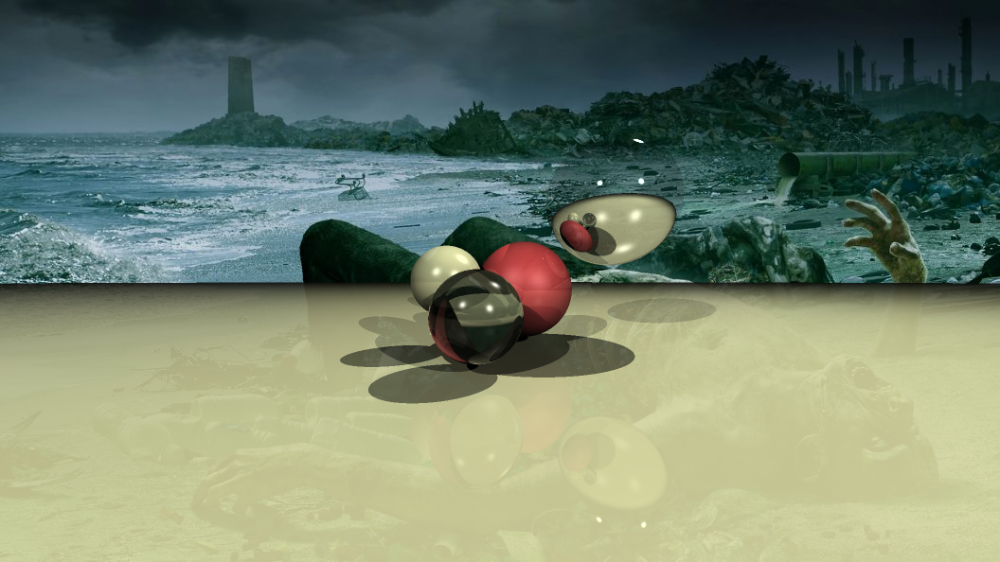
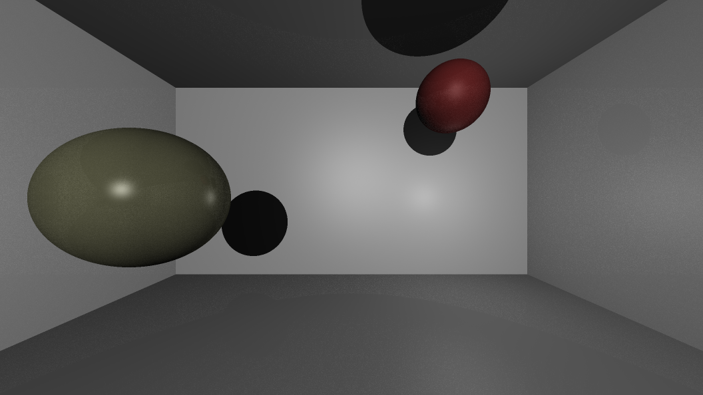
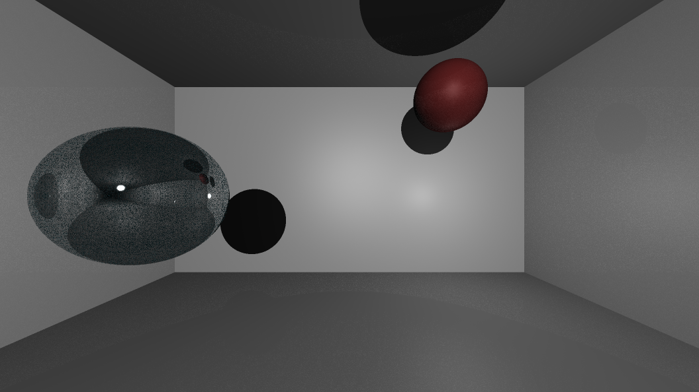

# RayTracing

Простой рендерер изображений, использующий техники [трассировки лучей](https://ru.wikipedia.org/wiki/%D0%A2%D1%80%D0%B0%D1%81%D1%81%D0%B8%D1%80%D0%BE%D0%B2%D0%BA%D0%B0_%D0%BB%D1%83%D1%87%D0%B5%D0%B9) и [трассировки путей](https://ru.wikipedia.org/wiki/%D0%A2%D1%80%D0%B0%D1%81%D1%81%D0%B8%D1%80%D0%BE%D0%B2%D0%BA%D0%B0_%D0%BF%D1%83%D1%82%D0%B8).

# Реализованные возможности
## Трассировка лучей Уиттеда
- Сцена 1.
Базовая часть(15 баллов):
- Используется модель Фонга локального освещения.
- Реализованы тени и зеркальное отражение.
- Реализованы два примитива: бесконечная плоскость и сфера.
- Реализованы 5 различных материалов: слоновая кость, красная резина, зеркало, стекло и серая поверхность(+1 за преломления).
- Реализована поддержка точечных источников света: в первой сцене используется 3 точечных источника света, во второй 2, в третьей -- 1.
- Реализовано сглаживание посредством суперсемплирования (+1).
- Реализована возможность использования кастомного изображения в качестве фона(параметр -background).
Данное изображение рендерится меньше секунды на процессоре Intel i5-8250U с использованием 8 потоков:

## Трассировка путей
- Сцены 2 и 3.
- Реализован базовый алгоритм трассировки путей (+5).
- В качестве критерия останова используется оценка дисперсии цвета с регулируемым значением ошибки. Кроме того, можно задать минимальное количество трассируемых путей для каждого пиксела.
- Для ускорения рендеринга используется техника генерации теневых лучей.
- Для ламбертовых материалов используется выборка по значимости (+3).
- Реализована исправленная модель Фонга для материалов с глянцевым отражением с использованием выборки по значимости (+3).
- Реализована модель идеального зеркала (+1).
Данная сцена рендерится за минуту 10 секунд на процессоре Intel i5-8250U с использованием 8 потоков:

Следующая сцена также рендерится за минуту 10 секунд на процессоре Intel i5-8250U с использованием 8 потоков:

## Дополнительно
- Реализована многопоточность посредством OpenMP, максимальное количество потоков можно задавать с помощью аргумента командной строки threads. По умолчанию количество потоков равно количеству ядер процессора. (+2)

# Сборка
Для сборки понадобятся Clang с поддержкой C++17, CMake и OpenMP. Для сборки нужно выполнить команды:
```
mkdir build
cmake --build build/ -DCMAKE_BUILD_TYPE=Release
```

# Запуск
Запуск программы производится следующим образом:
```
./build/RayTracing -out <путь к выходному изображению> -scene <номер сцены> [-threads <максимальное количество потоков> -background <фоновое изображение>]
```
Если запустить программу без аргументов, выведется сообщение с форматом командной строки.
Аргументы могут передаваться в любом порядке, аргументы out и scene обязательны, аргументы
threads и background опциональны.

# Зависимости 
Для записи изображений в png используется библиотека [stb_image_write](https://github.com/nothings/stb/blob/master/stb_image_write.h).
Для чтения изображений используется библиотека [stb_image](https://github.com/nothings/stb/blob/master/stb_image.h)
